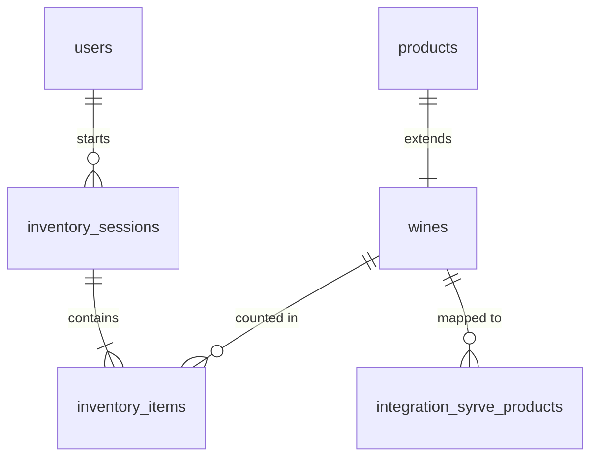

# Database Schema Validation & Architecture

## Overview
This document outlines the database architecture for the Wine Restaurant Inventory System, focusing on the Supabase (PostgreSQL) implementation. It includes the schema design, relationships, validation procedures, and performance considerations.

## 1. Schema Architecture

The database follows a **Normalized** structure with a **Joined Inheritance** pattern for products.

### Core Entities

#### `products`
The base table for all sellable items (Wines, Food, Merchandise).
- **Primary Key**: `id` (UUID)
- **Key Columns**: `name`, `sku`, `stock_on_hand`, `category_id`
- **Purpose**: enable unified searching and stock tracking across all types.

#### `wines`
An extension table for wine-specific attributes. It has a 1:1 relationship with `products`.
- **Primary Key**: `id` (UUID)
- **Foreign Key**: `product_id` -> `products.id` (Unique, Cascade Delete)
- **Rich Data**: `vintage`, `producer`, `region`, `grape_varieties`, `tasting_notes`, `body`, `sweetness`, `pricing`.
- **Normalization**: Separates distinct wine attributes from generic product data, preventing sparse tables.

### Inventory Management

#### `inventory_sessions`
Represents a stock-taking event.
- **Primary Key**: `id` (UUID)
- **Columns**: `status` (draft, in_progress, completed), `started_at`, `location_filter`.
- **Purpose**: Groups counts into logical sessions.

#### `inventory_items`
Individual count records within a session.
- **Primary Key**: `id` (UUID)
- **Foreign Keys**: 
  - `session_id` -> `inventory_sessions.id`
  - `wine_id` -> `wines.id` (or `product_id`)
- **Columns**: `counted_quantity_unopened`, `counted_quantity_opened`, `counting_method` (barcode, manual, ai).

### Integration (Syrve)

#### `integration_syrve_config`
Singleton configuration for the external POS system.
- **Columns**: `base_url`, `api_login`, `default_store_id`.

#### `integration_syrve_products`
Mapping table to link local wines to Syrve POS products.
- **Foreign Keys**: `mapped_wine_id` -> `wines.id`
- **Columns**: `syrve_product_id` (External UUID), `product_code`.

## 2. Entity-Relationship Diagram (Textual)



## 3. Validation Strategy

We employ a "Trust but Verify" approach using the Supabase Client SDK.

### Automated Validation Script
Located at: `src/test/db-validation.test.ts`

**Mechanism**:
1. **RPC Function**: A secured Postgres function `get_schema_info` returns the current schema structure (tables, columns, FKs) as JSON.
2. **Test Suite**: A Vitest suite calls this RPC and asserts that:
   - Critical tables exist.
   - Required columns are present with correct types.
   - Foreign Key constraints are active.

**Usage**:
```bash
npm run test:db
# or
npx vitest run src/test/db-validation.test.ts
```
*Note: Requires Admin privileges.*

## 4. Performance Optimization

### Indexing Strategy
- **Search**: B-Tree indexes on `products.name` and `wines.producer` for fast catalog filtering.
- **Foreign Keys**: All FK columns (`product_id`, `session_id`, `wine_id`) are indexed to support fast Joins.
- **Syrve Lookup**: Index on `integration_syrve_products.syrve_product_id` for O(1) lookup during sync.

### Partitioning (Future)
- **`inventory_items`**: As history grows, this table should be partitioned by `created_at` (Year/Month) to maintain query performance for recent sessions.

### Views
- **`view_wine_products`**: A materialized view or standard view is used to flatten `products` + `wines` for the frontend catalog, reducing complexity in the API layer.

## 5. Migration Safety
- **Transactional DDL**: All migrations are wrapped in transactions.
- **Idempotency**: Scripts use `IF NOT EXISTS` to allow re-running without errors.
- **Rollback**: Standard Supabase `migration down` (if enabled) or manual SQL reversion scripts are prepared.
