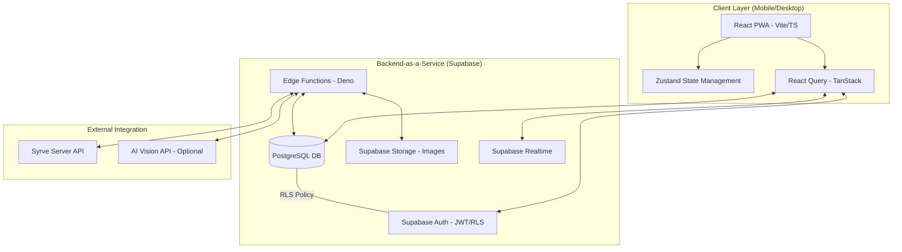
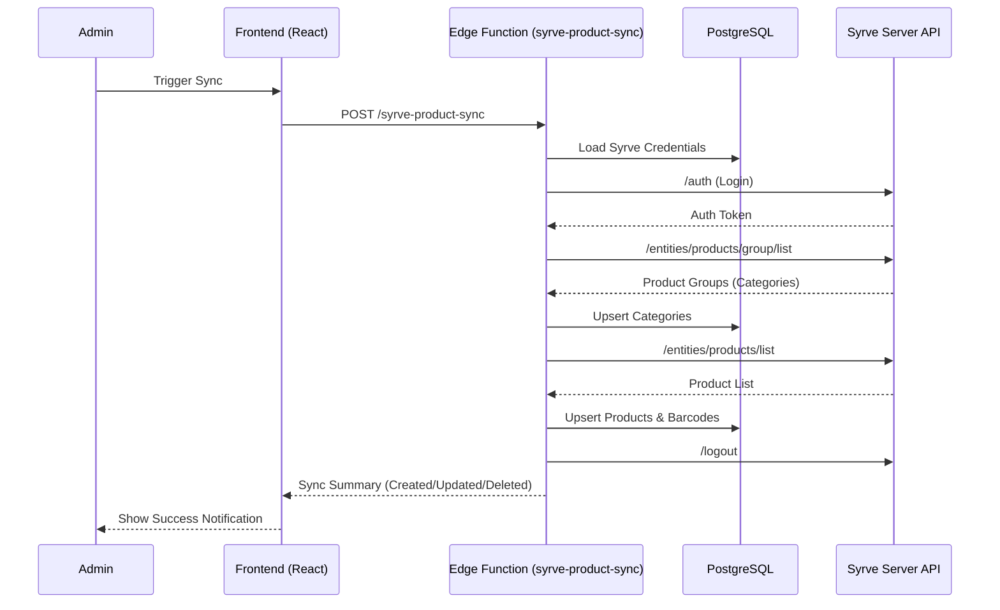
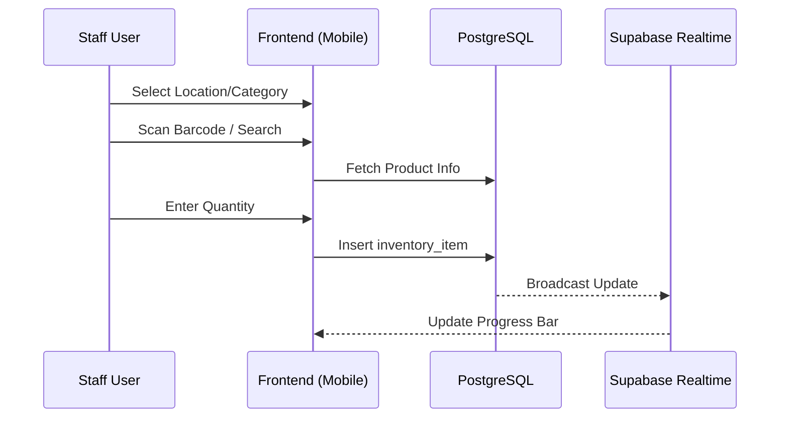

# 01 — Technical Architecture Specifications

## System Overview

The Inventory Management System is a robust, category-agnostic platform designed to bridge the gap between physical inventory counting and the **Syrve (iiko)** master system. It employs a modern, cloud-native architecture built on the Supabase platform, utilizing React for the frontend and PostgreSQL for the data layer.

### Core Architectural Principles
1.  **Syrve as Source of Truth**: All product data, categories, and units are mastered in Syrve.
2.  **Offline-First Strategy**: Support for inventory counting in environments with poor connectivity (e.g., cellars, warehouses).
3.  **Category-Agnostic Design**: Dynamic data structures that handle any product type (Wine, Food, Spirits, Supplies).
4.  **Role-Based Access Control (RBAC)**: Strict hierarchy of permissions (Super Admin, Admin, Manager, Staff).
5.  **Modular & Extensible**: A shared UI library and isolated functional modules.

---

## High-Level Architecture Diagram

---

## Data Flow Architecture

### 1. Master Data Synchronization (Syrve → App)
The system periodically or manually synchronizes product data from Syrve to a local PostgreSQL cache to ensure high performance and offline availability.

### 2. Inventory Counting Flow (Collaborative)
Multiple users can count products simultaneously. Results are additive and stored in the `inventory_items` table.

---

## Technology Stack

### 1.2 Frontend Architecture (Mobile-First PWA)
- **Framework**: Next.js 14 (App Router) with Tailwind CSS.
- **State Management**: Zustand with `persist` middleware for offline-first capability.
- **Offline Storage**: IndexedDB (via `idb-keyval` or `dexie`) for caching large product catalogs.
- **Service Workers**: Workbox for precaching assets and background sync of inventory counts.
- **UI Components**: Shadcn UI + Radix UI, optimized for high-contrast/dim environments.

### Backend (Supabase)
- **Database**: PostgreSQL 15+
- **Auth**: Supabase Auth (JWT)
- **Functions**: Supabase Edge Functions (Deno / TypeScript)
- **Realtime**: PostgreSQL CDC (Change Data Capture)
- **Storage**: Supabase Storage
- **Security**: Row Level Security (RLS)

### 1.3 AI & Recognition Pipeline
- **Barcode Scanning**: `html5-qrcode` or Scandit SDK for high-performance scanning in low light.
- **Label Recognition**: Edge Function utilizing OpenAI Vision or Google Vision API for OCR and visual matching when barcodes are missing.
- **Edge Processing**: Local image compression before upload to minimize data usage in cellars.

---

## Component Architecture

The application is structured into several core layers:

1.  **Shared UI Components (`/src/components/ui`)**: Atomic components based on Shadcn UI.
2.  **Feature Modules (`/src/modules`)**: Encapsulated logic for Inventory, Catalog, Settings, and Reports.
3.  **Data Layer (`/src/hooks` & `/src/integrations`)**: React Query hooks for API interaction and Supabase client configuration.
4.  **State Layer (`/src/stores`)**: Global state management for Auth, UI state, and persistent settings.
5.  **Utilities (`/src/utils`)**: Shared helper functions for data formatting, calculations, and validation.
