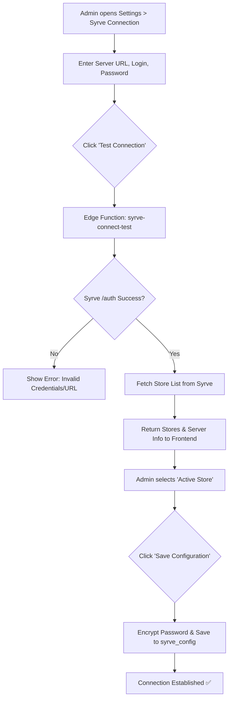
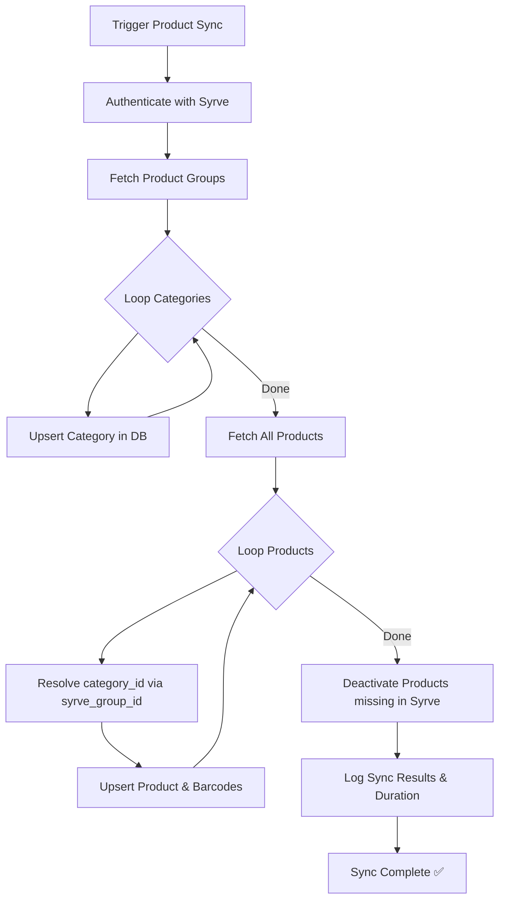
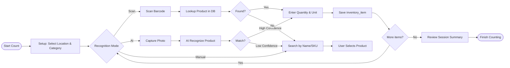
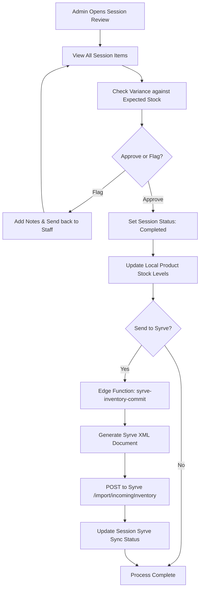

# 02 — Business Logic Flows

## 1. Syrve Connection & Authentication Flow

Before any inventory operations can occur, the Admin must establish a secure link with the Syrve server.

---

## 2. Product Synchronization Logic (Syrve → App)

Synchronizing data involves a hierarchical update to ensure categories exist before products are mapped to them.

---

## 3. Inventory Counting Session (Staff Workflow)

The physical counting process is designed for speed and accuracy in high-pressure environments.

---

## 4. Session Review & Syrve Commitment (Admin Workflow)

The final step bridges the gap between the app's counted values and Syrve's inventory management.

---

### 2.2 Counting & Entry Logic
1.  **Item Identification**: Scan barcode OR Search by Name/SKU OR AI Label Recognition.
2.  **Variant Selection**: If item has variants (e.g., Size, Vintage), user selects the specific variant.
3.  **State Selection**: 
    -   **Full/Unopened**: Enter integer quantity.
    -   **Partial/Opened**: Enter decimal (e.g., 0.5) or use visual "slider" for bottle fill level.
4.  **Local Save**: Immediate save to Zustand/IndexedDB.
5.  **Conflict Resolution**: If same item counted by another user, prompt for "Merge", "Overwrite", or "Keep Both" (session-based).

### 2.3 AI Recognition Flow
1.  **Trigger**: User clicks "AI Scan" button.
2.  **Capture**: Mobile camera captures label/bottle.
3.  **Process**: 
    -   Client-side compression.
    -   Edge Function: OCR + Feature Extraction.
    -   Matching: Search Supabase `products` then Syrve local cache.
4.  **Verification**: User confirms matched item.
5.  **Learning**: System logs match confidence for future model fine-tuning.
