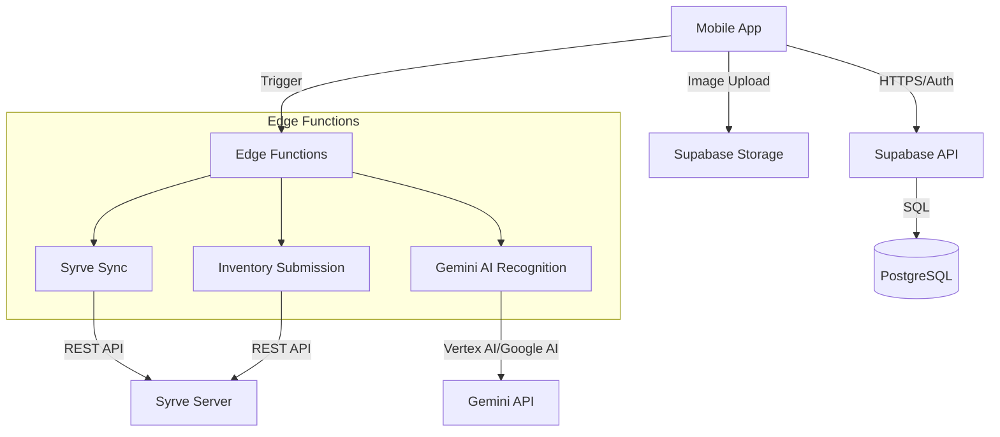

# 01 — Technical Architecture

## Overview

The Inventory AI platform is a mobile-first, category-agnostic inventory management system designed to integrate seamlessly with Syrve (iiko) for product and stock synchronization. It utilizes a modern tech stack centered around React, Supabase, and Google Gemini AI for automated product recognition.

---

## 1. High-Level Tech Stack

| Component | Technology |
|-----------|------------|
| **Frontend** | React (Vite), TypeScript, Tailwind CSS, Shadcn UI |
| **State Management** | Zustand (Global), React Query (Server state) |
| **Backend/Database** | Supabase (PostgreSQL, Auth, Storage) |
| **AI Engine** | Google Gemini (Pro Vision for image recognition) |
| **Integration Layer** | Supabase Edge Functions (Deno) |
| **PWA Support** | Vite PWA Plugin (Offline caching, installable) |

---

## 2. System Components

### 2.1 Core Modules
- **Inventory Module**: Manages current stock, counting sessions, and historical data.
- **Product Module**: Handles category-agnostic product catalog synced from Syrve.
- **Integration Module**: Manages Syrve connection, authentication, and data sync.
- **Admin Module**: Comprehensive configuration, user management, and feature flags.
- **AI Module**: Gemini-powered barcode and product recognition logic.

### 2.2 Integration Flow (Syrve)
1. **Auth**: Edge Function exchanges encrypted credentials for a session token.
2. **Product Sync**: Fetches groups and products, mapping them to the category-agnostic schema.
3. **Stock Reconciliation**: Pulls expected stock levels from Syrve.
4. **Inventory Commit**: Aggregates multi-user/multi-location counts into a single Syrve-compatible XML/JSON document for submission.

---

## 3. Data Flow Architecture

---

## 4. Security & Authentication

- **Authentication**: Supabase Auth (JWT) with Role-Based Access Control (RBAC).
- **Sensitive Data**: Syrve credentials (login/pass) are stored encrypted in the database and only decrypted within Edge Functions using a secret environment variable.
- **RLS (Row Level Security)**: Every table has strict RLS policies ensuring users only see what their role allows.
- **AI Privacy**: Images sent to Gemini are processed in a stateless manner; no customer data is used for training.

---

## 5. Mobile Optimization Strategy

- **Native-Feel UI**: Use of Sheets (bottom drawers) for selection, Haptic feedback (where possible), and full-screen camera interfaces.
- **Offline First**: Inventory counts are stored in local state (Zustand/IndexDB) and synced to Supabase when a connection is available.
- **PWA**: Optimized manifest and service worker for "App-like" experience on iOS and Android.

---

## 6. AI Recognition (Gemini)

The system uses **Google Gemini 1.5 Pro Vision** to:
1. **Identify Products**: Analyze photos of bottles/items to identify Name, SKU, and Category.
2. **Extract Metadata**: Read labels for ABV, Vintage, Producer, and Region (for wine) or generic attributes for other categories.
3. **Verify Barcodes**: Fallback recognition when barcodes are missing or damaged.

---

## 7. Multi-Tenant / SaaS Scalability

- **Super Admin Role**: Global management of clients, modules, and feature flags.
- **Feature Flags**: Granular control over functionality (e.g., "ai_recognition", "syrve_auto_sync") managed at the business level.
- **Custom Branding**: Business-specific logos, names, and configuration stored in `business_profile`.
