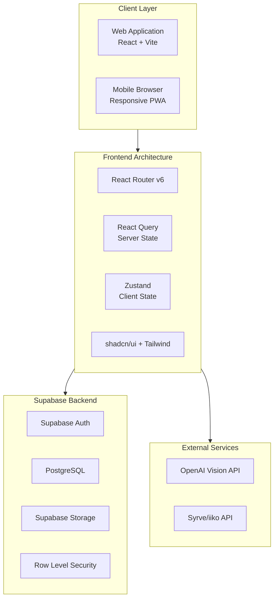
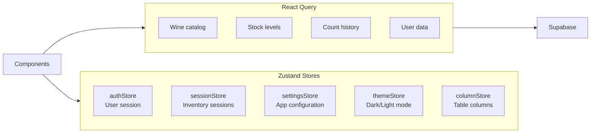
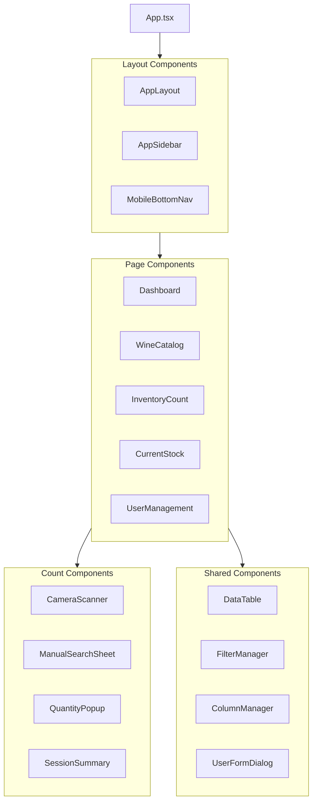
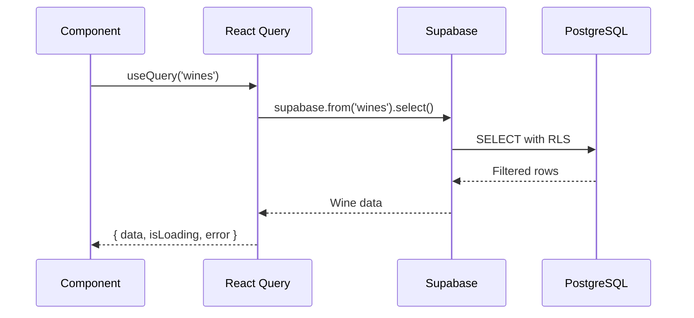
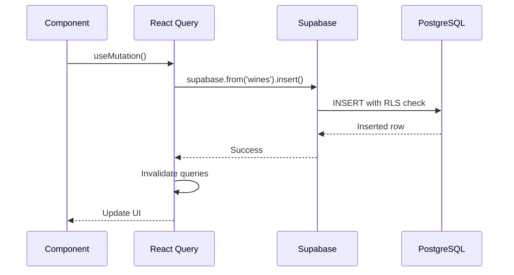
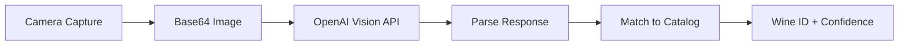
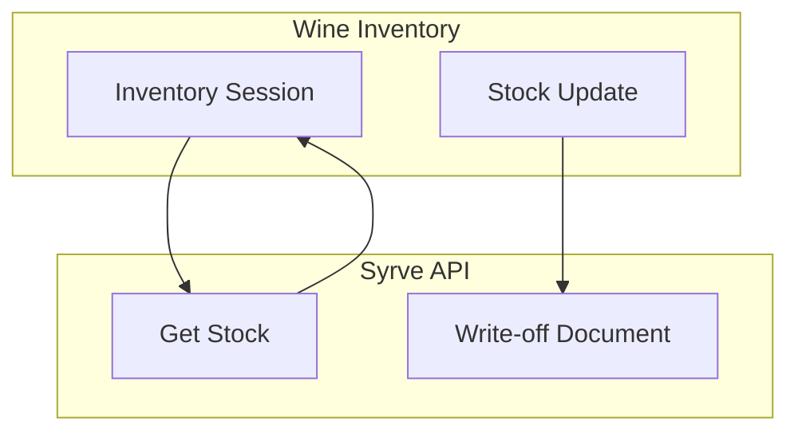
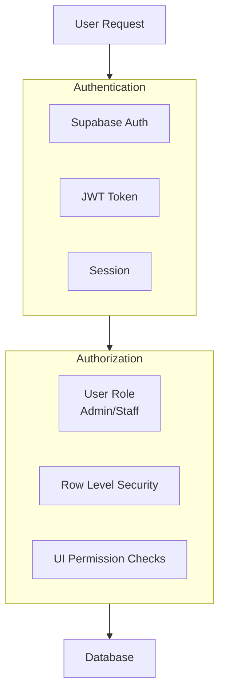
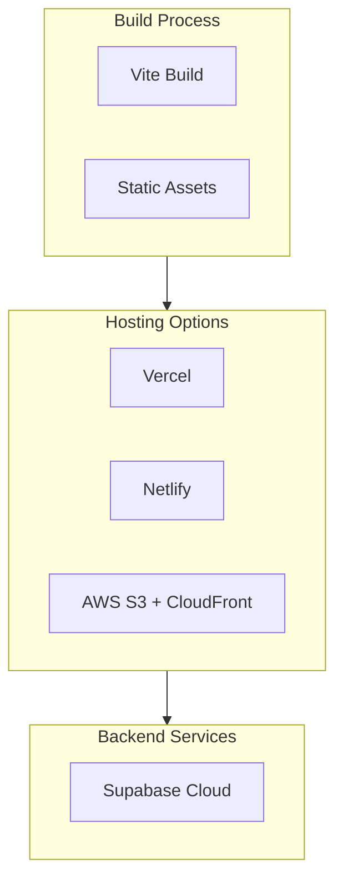

# System Architecture

## Overview

The Wine Inventory Management System follows a modern JAMstack architecture with a React frontend and Supabase backend-as-a-service.

---

## High-Level Architecture



---

## Frontend Architecture

### Technology Stack

| Technology | Version | Purpose |
|------------|---------|---------|
| React | 18.x | UI framework |
| TypeScript | 5.x | Type safety |
| Vite | 5.x | Build tool & dev server |
| React Router | 6.x | Client-side routing |
| TanStack Query | 5.x | Server state management |
| Zustand | 4.x | Client state management |
| shadcn/ui | Latest | UI component library |
| Tailwind CSS | 3.x | Utility-first styling |

### State Management



### Store Details

| Store | File | Purpose |
|-------|------|---------|
| `authStore` | `stores/authStore.ts` | User authentication state, role, permissions |
| `sessionStore` | `stores/sessionStore.ts` | Current inventory counting session |
| `settingsStore` | `stores/settingsStore.ts` | Application settings, preferences |
| `themeStore` | `stores/themeStore.ts` | Dark/light theme toggle |
| `columnStore` | `stores/columnStore.ts` | DataTable column visibility |

---

## Component Architecture



### Component Categories

| Category | Location | Count | Description |
|----------|----------|-------|-------------|
| Pages | `src/pages/` | 18 | Route-level components |
| UI Primitives | `src/components/ui/` | 49 | shadcn/ui base components |
| Count | `src/components/count/` | 6 | Inventory counting flow |
| Layout | `src/components/` | 11 | App structure components |

---

## Backend Architecture (Supabase)

### Services Used

| Service | Purpose |
|---------|---------|
| **Auth** | User authentication, session management |
| **Database** | PostgreSQL with RLS policies |
| **Storage** | Wine images, uploaded photos |
| **Edge Functions** | AI processing (future) |

### Database Connection

```typescript
// src/integrations/supabase/client.ts
import { createClient } from '@supabase/supabase-js';

const supabaseUrl = import.meta.env.VITE_SUPABASE_URL;
const supabaseKey = import.meta.env.VITE_SUPABASE_ANON_KEY;

export const supabase = createClient(supabaseUrl, supabaseKey);
```

---

## Data Flow Patterns

### Read Flow (React Query)



### Write Flow (Mutations)



---

## External Integrations

### OpenAI Vision API

Used for wine label recognition during inventory counting.



### Syrve (iiko) POS Integration

Bi-directional stock synchronization with restaurant POS.



---

## Security Architecture



See [09-security.md](./09-security.md) for detailed security documentation.

---

## Deployment Architecture



### Build Commands

```bash
# Development
npm run dev

# Production build
npm run build

# Preview production build
npm run preview
```
