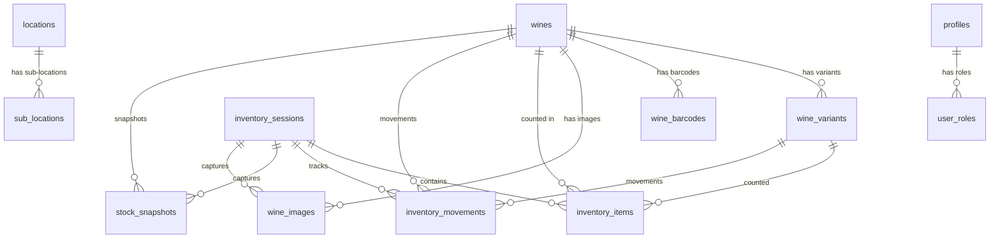

# Database Schema

## Overview

The Wine Inventory Management System uses PostgreSQL hosted on Supabase with Row Level Security (RLS) for access control.

---

## Entity Relationship Diagram



---

## Core Tables

### `wines`

The primary table for the wine catalog.

| Column | Type | Description |
|--------|------|-------------|
| `id` | UUID | Primary key |
| `name` | TEXT | Wine name (required) |
| `producer` | TEXT | Producer/winery name |
| `vintage` | INTEGER | Vintage year |
| `wine_type` | ENUM | Red, White, Rosé, Sparkling, etc. |
| `country` | TEXT | Country of origin |
| `region` | TEXT | Wine region |
| `appellation` | TEXT | Appellation/DOC/AOC |
| `volume_ml` | INTEGER | Bottle size in ml |
| `alcohol_content` | NUMERIC | ABV percentage |
| `current_stock_unopened` | INTEGER | Closed bottles count |
| `current_stock_opened` | INTEGER | Open bottles count |
| `purchase_price` | NUMERIC | Cost per bottle |
| `sale_price` | NUMERIC | Selling price |
| `primary_barcode` | TEXT | Primary UPC/EAN code |
| `min_stock_level` | INTEGER | Par level (reorder threshold) |
| `is_active` | BOOLEAN | Active in catalog |
| `created_at` | TIMESTAMP | Creation timestamp |
| `updated_at` | TIMESTAMP | Last update timestamp |

**Additional Fields:** 100+ fields for detailed wine information including tasting notes, critic scores, grape varieties, aging details, serving temperatures, etc.

---

### `wine_variants`

Wine variants for different vintages/sizes of the same wine.

| Column | Type | Description |
|--------|------|-------------|
| `id` | UUID | Primary key |
| `base_wine_id` | UUID | FK → wines |
| `vintage` | INTEGER | Variant vintage |
| `volume_ml` | INTEGER | Bottle size |
| `variant_sku` | TEXT | SKU code |
| `variant_barcode` | TEXT | Barcode |
| `current_stock` | INTEGER | Current quantity |
| `purchase_price` | NUMERIC | Cost |
| `sale_price` | NUMERIC | Selling price |
| `syrve_product_id` | TEXT | Syrve POS product ID |
| `is_active` | BOOLEAN | Active status |

---

### `wine_barcodes`

Multiple barcodes per wine (different distributors/regions).

| Column | Type | Description |
|--------|------|-------------|
| `id` | UUID | Primary key |
| `wine_id` | UUID | FK → wines |
| `barcode` | TEXT | Barcode value |
| `barcode_type` | TEXT | UPC-A, EAN-13, etc. |
| `is_primary` | BOOLEAN | Primary barcode flag |
| `distributor` | TEXT | Distributor source |
| `region` | TEXT | Regional barcode |
| `is_active` | BOOLEAN | Active status |

---

### `wine_images`

Images associated with wines (labels, bottles).

| Column | Type | Description |
|--------|------|-------------|
| `id` | UUID | Primary key |
| `wine_id` | UUID | FK → wines |
| `image_url` | TEXT | Image URL |
| `storage_key` | TEXT | Supabase Storage key |
| `is_primary` | BOOLEAN | Primary display image |
| `source` | TEXT | Upload source |
| `captured_during_inventory` | BOOLEAN | Captured during count |
| `inventory_session_id` | UUID | FK → inventory_sessions |
| `ai_confidence_score` | NUMERIC | AI recognition confidence |
| `ai_recognition_successful` | BOOLEAN | AI matched successfully |
| `ocr_text` | TEXT | Extracted text from label |
| `uploaded_by` | UUID | User who uploaded |
| `uploaded_at` | TIMESTAMP | Upload timestamp |

---

## Inventory Tables

### `inventory_sessions`

Inventory counting sessions.

| Column | Type | Description |
|--------|------|-------------|
| `id` | UUID | Primary key |
| `session_name` | TEXT | Session identifier |
| `status` | ENUM | draft, in_progress, completed, cancelled |
| `started_by` | UUID | User who started |
| `started_at` | TIMESTAMP | Start time |
| `completed_by` | UUID | User who completed |
| `completed_at` | TIMESTAMP | Completion time |
| `approved_by` | UUID | Admin who approved |
| `approved_at` | TIMESTAMP | Approval time |
| `total_wines_expected` | INTEGER | Expected count items |
| `total_wines_counted` | INTEGER | Actual counted items |
| `duration_seconds` | INTEGER | Session duration |
| `location_filter` | TEXT | Filtered location |

---

### `inventory_items`

Individual wine counts within a session.

| Column | Type | Description |
|--------|------|-------------|
| `id` | UUID | Primary key |
| `session_id` | UUID | FK → inventory_sessions |
| `wine_id` | UUID | FK → wines |
| `variant_id` | UUID | FK → wine_variants (optional) |
| `expected_quantity_unopened` | INTEGER | Expected closed bottles |
| `expected_quantity_opened` | INTEGER | Expected open bottles |
| `counted_quantity_unopened` | INTEGER | Counted closed |
| `counted_quantity_opened` | INTEGER | Counted open |
| `variance_unopened` | INTEGER | Difference (unopened) |
| `variance_opened` | INTEGER | Difference (opened) |
| `variance_total` | INTEGER | Total variance |
| `has_variance` | BOOLEAN | Variance flag |
| `counting_method` | ENUM | manual, barcode, image_ai |
| `confidence` | NUMERIC | AI confidence (0-100) |
| `counted_by` | UUID | User who counted |
| `counted_at` | TIMESTAMP | Count timestamp |
| `notes` | TEXT | Count notes |

---

### `inventory_movements`

Stock movement history.

| Column | Type | Description |
|--------|------|-------------|
| `id` | UUID | Primary key |
| `wine_id` | UUID | FK → wines |
| `variant_id` | UUID | FK → wine_variants |
| `session_id` | UUID | FK → inventory_sessions |
| `movement_type` | ENUM | count, adjustment, sale, purchase, transfer, waste |
| `quantity_change` | INTEGER | Amount changed (+/-) |
| `quantity_before` | INTEGER | Stock before |
| `quantity_after` | INTEGER | Stock after |
| `bottle_state` | ENUM | unopened, opened |
| `recording_method` | TEXT | How recorded |
| `barcode_scanned` | TEXT | Scanned barcode |
| `ai_confidence_score` | NUMERIC | AI confidence |
| `captured_image_id` | UUID | FK → wine_images |
| `reason` | TEXT | Movement reason |
| `performed_by` | UUID | User ID |
| `performed_at` | TIMESTAMP | Timestamp |

---

### `stock_snapshots`

Point-in-time stock records.

| Column | Type | Description |
|--------|------|-------------|
| `id` | UUID | Primary key |
| `wine_id` | UUID | FK → wines |
| `session_id` | UUID | FK → inventory_sessions |
| `stock_unopened` | INTEGER | Closed bottles |
| `stock_opened` | INTEGER | Open bottles |
| `total_stock` | INTEGER | Total quantity |
| `unit_cost` | NUMERIC | Per-unit cost |
| `total_value` | NUMERIC | Stock value |
| `snapshot_date` | DATE | Snapshot date |
| `snapshot_time` | TIME | Snapshot time |
| `snapshot_type` | TEXT | Trigger type |
| `triggered_by` | UUID | User who triggered |

---

## User & Security Tables

### `profiles`

User profile information.

| Column | Type | Description |
|--------|------|-------------|
| `id` | UUID | PK (matches auth.users.id) |
| `first_name` | TEXT | First name |
| `last_name` | TEXT | Last name |
| `display_name` | TEXT | Display name |
| `avatar_url` | TEXT | Avatar image URL |
| `phone` | TEXT | Phone number |
| `job_title` | TEXT | Job title |
| `department` | TEXT | Department |
| `is_active` | BOOLEAN | Account active |
| `is_locked` | BOOLEAN | Account locked |
| `failed_login_attempts` | INTEGER | Failed logins |
| `last_login_at` | TIMESTAMP | Last login time |

---

### `user_roles`

User role assignments.

| Column | Type | Description |
|--------|------|-------------|
| `id` | UUID | Primary key |
| `user_id` | UUID | FK → profiles |
| `role` | ENUM | admin, staff |

---

### `app_roles_config`

Role permission configuration.

| Column | Type | Description |
|--------|------|-------------|
| `id` | UUID | Primary key |
| `role_name` | TEXT | Role identifier |
| `permissions` | JSONB | Permission flags |
| `color` | TEXT | UI display color |
| `is_builtin` | BOOLEAN | System role flag |

---

### `audit_logs`

Comprehensive audit trail.

| Column | Type | Description |
|--------|------|-------------|
| `id` | UUID | Primary key |
| `user_id` | UUID | Acting user |
| `action` | TEXT | Action type |
| `entity_type` | TEXT | Entity affected |
| `entity_id` | UUID | Entity ID |
| `entity_name` | TEXT | Entity name |
| `old_values` | JSONB | Previous values |
| `new_values` | JSONB | New values |
| `changed_fields` | TEXT[] | Changed field names |
| `ip_address` | TEXT | Client IP |
| `success` | BOOLEAN | Action success |
| `error_message` | TEXT | Error if failed |
| `performed_at` | TIMESTAMP | Action timestamp |

---

## Reference Tables

### `locations`

Storage locations.

| Column | Type | Description |
|--------|------|-------------|
| `id` | UUID | Primary key |
| `name` | TEXT | Location name |
| `type` | TEXT | Location type |
| `is_active` | BOOLEAN | Active status |

### `sub_locations`

Sub-locations within locations.

| Column | Type | Description |
|--------|------|-------------|
| `id` | UUID | Primary key |
| `location_id` | UUID | FK → locations |
| `name` | TEXT | Sub-location name |
| `is_active` | BOOLEAN | Active status |

### `suppliers`

Wine suppliers.

| Column | Type | Description |
|--------|------|-------------|
| `id` | UUID | Primary key |
| `name` | TEXT | Supplier name |
| `contact_name` | TEXT | Contact person |
| `email` | TEXT | Email address |
| `phone` | TEXT | Phone number |
| `address` | TEXT | Street address |
| `city` | TEXT | City |
| `country` | TEXT | Country |
| `is_active` | BOOLEAN | Active status |

### `grape_varieties`

Grape variety reference.

| Column | Type | Description |
|--------|------|-------------|
| `id` | UUID | Primary key |
| `name` | TEXT | Variety name |
| `color` | TEXT | Red/White |
| `description` | TEXT | Description |
| `is_active` | BOOLEAN | Active status |

### `volume_options`

Bottle size options.

| Column | Type | Description |
|--------|------|-------------|
| `id` | UUID | Primary key |
| `label` | TEXT | Display label (e.g., "750ml") |
| `ml` | INTEGER | Volume in milliliters |
| `bottle_size` | TEXT | Size category |
| `is_active` | BOOLEAN | Active status |

### `glass_dimensions`

Glass pour sizes.

| Column | Type | Description |
|--------|------|-------------|
| `id` | UUID | Primary key |
| `label` | TEXT | Display label |
| `volume_litres` | NUMERIC | Volume in liters |
| `is_active` | BOOLEAN | Active status |

---

## Enums

```sql
-- Wine types
CREATE TYPE wine_type_enum AS ENUM (
  'red', 'white', 'rose', 'sparkling', 
  'fortified', 'dessert', 'orange'
);

-- Session status
CREATE TYPE session_status_enum AS ENUM (
  'draft', 'in_progress', 'pending_review', 
  'completed', 'cancelled'
);

-- Counting methods
CREATE TYPE counting_method_enum AS ENUM (
  'manual', 'barcode', 'image_ai'
);

-- Movement types
CREATE TYPE movement_type_enum AS ENUM (
  'count', 'adjustment', 'sale', 'purchase', 
  'transfer', 'waste', 'breakage'
);

-- Bottle states
CREATE TYPE bottle_state_enum AS ENUM (
  'unopened', 'opened'
);

-- User roles
CREATE TYPE app_role AS ENUM (
  'admin', 'staff'
);
```

---

## TypeScript Types

Generated types are available in `src/integrations/supabase/types.ts` (1670 lines).

Usage:
```typescript
import { Database } from '@/integrations/supabase/types';

type Wine = Database['public']['Tables']['wines']['Row'];
type WineInsert = Database['public']['Tables']['wines']['Insert'];
type WineUpdate = Database['public']['Tables']['wines']['Update'];
```
