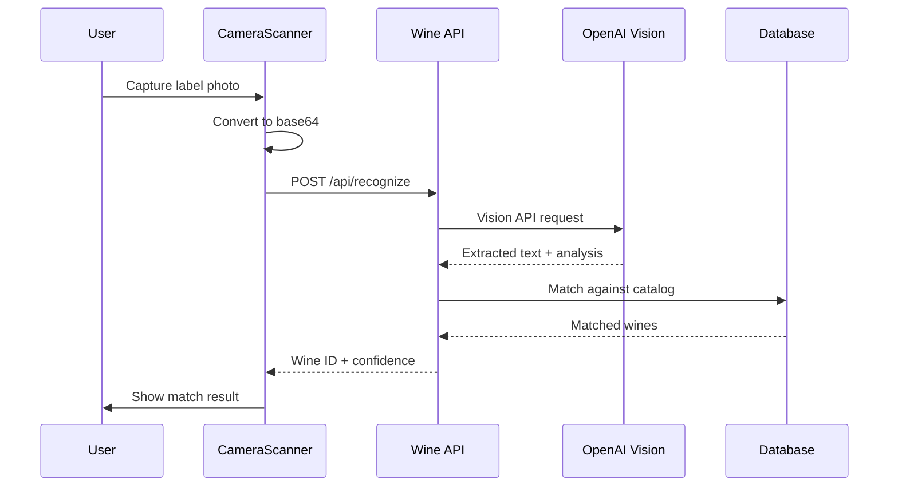
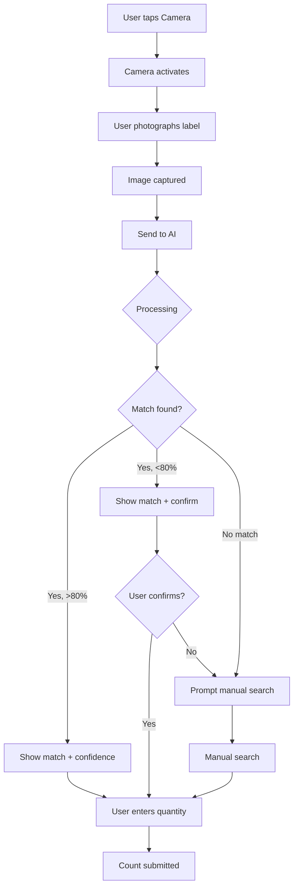

# AI Integration

## Overview

The Wine Inventory Management System uses AI-powered image recognition to identify wines by their labels during inventory counting.

---

## AI Capabilities

### Wine Label Recognition

- **Purpose:** Automatically identify wines from photos of their labels
- **Technology:** OpenAI Vision API (GPT-4 Vision)
- **Accuracy Target:** >90% for wines in catalog
- **Fallback:** Manual search if confidence <80%

---

## Architecture



---

## OpenAI Vision Integration

### Request Format

```typescript
const response = await openai.chat.completions.create({
  model: "gpt-4-vision-preview",
  messages: [
    {
      role: "system",
      content: `You are a wine label recognition expert. 
        Analyze the wine label image and extract:
        - Wine name
        - Producer/Winery
        - Vintage year
        - Wine type (red/white/rosé/sparkling)
        - Region/Country
        - Any other visible information
        Return as JSON.`
    },
    {
      role: "user",
      content: [
        {
          type: "image_url",
          image_url: {
            url: `data:image/jpeg;base64,${base64Image}`,
            detail: "high"
          }
        }
      ]
    }
  ],
  max_tokens: 500
});
```

### Response Processing

```typescript
interface LabelExtractionResult {
  name: string;
  producer: string;
  vintage: number | null;
  wine_type: 'red' | 'white' | 'rose' | 'sparkling' | null;
  region: string | null;
  country: string | null;
  appellation: string | null;
  raw_text: string[];
  confidence: number;
}
```

---

## Matching Algorithm

### Step 1: Text Extraction

AI extracts key information from label:
- Wine name
- Producer name
- Vintage year
- Additional text (appellation, region)

### Step 2: Catalog Matching

```typescript
async function matchWineToCatalog(
  extraction: LabelExtractionResult
): Promise<WineMatch[]> {
  // Primary match: Name + Vintage
  let matches = await supabase
    .from('wines')
    .select('*')
    .ilike('name', `%${extraction.name}%`)
    .eq('vintage', extraction.vintage)
    .eq('is_active', true);
  
  if (matches.data?.length === 0) {
    // Fallback: Name only
    matches = await supabase
      .from('wines')
      .select('*')
      .ilike('name', `%${extraction.name}%`)
      .eq('is_active', true);
  }
  
  if (matches.data?.length === 0) {
    // Secondary: Producer + Region
    matches = await supabase
      .from('wines')
      .select('*')
      .ilike('producer', `%${extraction.producer}%`)
      .eq('is_active', true);
  }
  
  return calculateConfidence(matches.data, extraction);
}
```

### Step 3: Confidence Scoring

| Factor | Weight | Description |
|--------|--------|-------------|
| Exact name match | 40% | Wine name matches exactly |
| Vintage match | 20% | Vintage year matches |
| Producer match | 20% | Producer name matches |
| Region match | 10% | Region/country matches |
| Type match | 10% | Wine type matches |

```typescript
function calculateConfidence(
  matches: Wine[],
  extraction: LabelExtractionResult
): WineMatch[] {
  return matches.map(wine => {
    let score = 0;
    
    // Name match (40%)
    if (wine.name.toLowerCase() === extraction.name.toLowerCase()) {
      score += 40;
    } else if (wine.name.toLowerCase().includes(extraction.name.toLowerCase())) {
      score += 25;
    }
    
    // Vintage match (20%)
    if (wine.vintage === extraction.vintage) {
      score += 20;
    }
    
    // Producer match (20%)
    if (wine.producer?.toLowerCase() === extraction.producer?.toLowerCase()) {
      score += 20;
    } else if (wine.producer?.toLowerCase().includes(extraction.producer?.toLowerCase() || '')) {
      score += 10;
    }
    
    // Region match (10%)
    if (wine.region?.toLowerCase() === extraction.region?.toLowerCase()) {
      score += 10;
    }
    
    // Type match (10%)
    if (wine.wine_type === extraction.wine_type) {
      score += 10;
    }
    
    return { wine, confidence: score };
  }).sort((a, b) => b.confidence - a.confidence);
}
```

---

## User Flow



---

## Image Storage

Captured images are stored for audit purposes:

```typescript
// Store in wine_images table
await supabase.from('wine_images').insert({
  wine_id: matchedWineId,
  image_url: storageUrl,
  storage_key: storagePath,
  source: 'inventory_capture',
  captured_during_inventory: true,
  inventory_session_id: sessionId,
  ai_confidence_score: confidence,
  ai_recognition_successful: confidence >= 80,
  ocr_text: extraction.raw_text.join(' '),
  uploaded_by: userId
});
```

---

## Error Handling

| Scenario | Handling |
|----------|----------|
| API timeout | Retry up to 3 times with exponential backoff |
| No text extracted | Prompt user to retake photo with better lighting |
| Low confidence (<50%) | Direct to manual search |
| API rate limit | Queue requests, show loading state |
| Network error | Cache image, retry when connected |

---

## Performance Optimization

### Image Preprocessing

Before sending to API:
- Resize to max 1024x1024
- Convert to JPEG (quality 85%)
- Compress if >2MB

```typescript
async function preprocessImage(file: File): Promise<string> {
  const canvas = document.createElement('canvas');
  const ctx = canvas.getContext('2d');
  const img = await loadImage(file);
  
  // Scale down if needed
  const maxSize = 1024;
  let { width, height } = img;
  if (width > maxSize || height > maxSize) {
    const ratio = Math.min(maxSize / width, maxSize / height);
    width *= ratio;
    height *= ratio;
  }
  
  canvas.width = width;
  canvas.height = height;
  ctx.drawImage(img, 0, 0, width, height);
  
  return canvas.toDataURL('image/jpeg', 0.85).split(',')[1];
}
```

### Caching

- Cache recent API responses
- Store extracted text with wine images
- Reuse matches for similar labels

---

## Metrics & Monitoring

Track AI performance:
- Recognition success rate
- Average confidence score
- Processing time
- Fallback rate (to manual search)
- OCR quality metrics

```sql
-- Example: Recognition success rate
SELECT 
  DATE(uploaded_at) as date,
  COUNT(*) as total_scans,
  COUNT(*) FILTER (WHERE ai_recognition_successful) as successful,
  ROUND(AVG(ai_confidence_score), 2) as avg_confidence
FROM wine_images
WHERE captured_during_inventory = true
GROUP BY DATE(uploaded_at)
ORDER BY date DESC;
```

---

## Future Enhancements

1. **Custom Model Training** - Fine-tune on restaurant's specific wine collection
2. **Offline Recognition** - On-device ML for common wines
3. **Multi-label Recognition** - Process multiple bottles in one photo
4. **Damage Detection** - Identify damaged labels or bottles
5. **Price Tag Recognition** - Extract pricing from shelf tags
