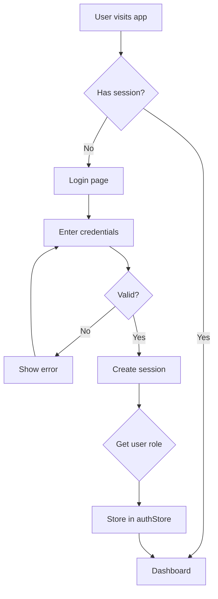
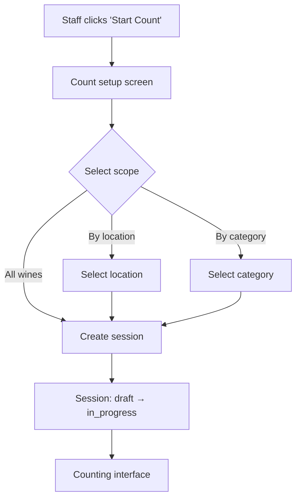
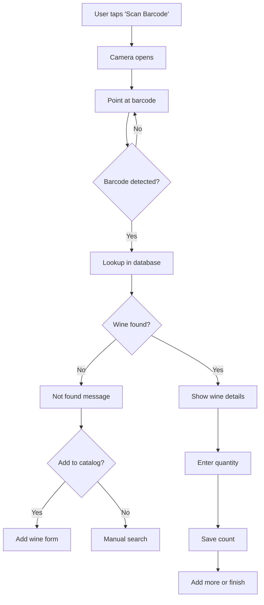
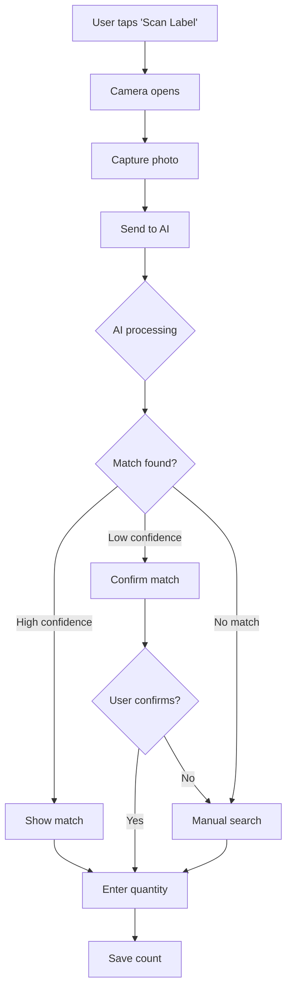
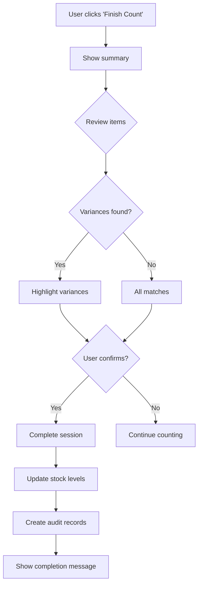
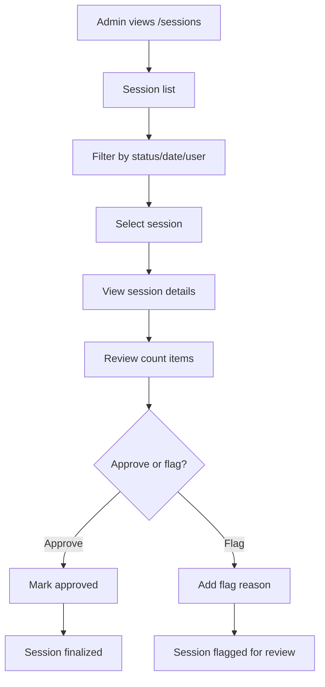
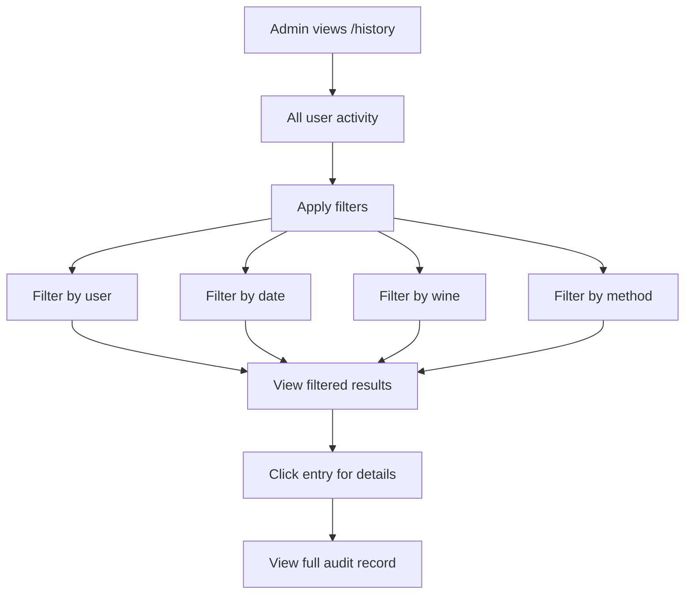
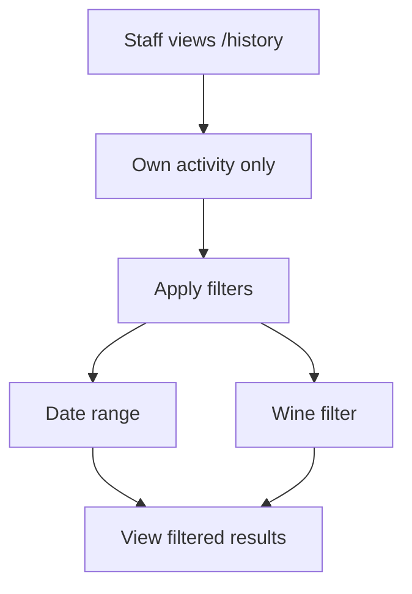
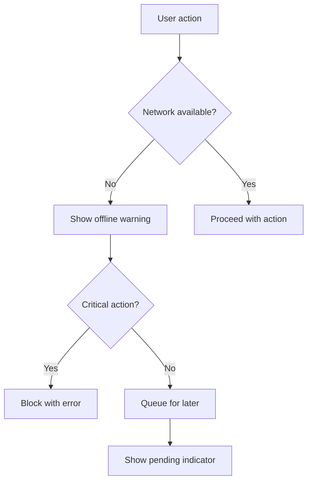
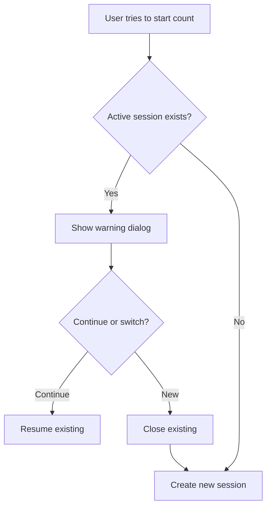

# User Flows

## Overview

This document describes the key user journeys for both Admin and Staff roles.

---

## Role Permissions Matrix

| Feature | Admin | Staff |
|---------|:-----:|:-----:|
| Login | ✓ | ✓ |
| Dashboard | ✓ | ✓ |
| View wine catalog | ✓ | ✓ |
| Add/Edit wines | ✓ | ✗ |
| Perform inventory count | ✓ | ✓ |
| View current stock | ✓ | ✗ |
| View all history | ✓ | ✗ |
| View own history | ✓ | ✓ |
| Manage users | ✓ | ✗ |
| Approve sessions | ✓ | ✗ |
| Generate reports | ✓ | ✗ |
| Configure settings | ✓ | ✗ |

> **Important:** Staff cannot view current stock levels to prevent counting bias.

---

## 1. Authentication Flow



### Login Steps

1. User navigates to `/login`
2. Enter email and password
3. Click "Sign In"
4. System validates credentials via Supabase Auth
5. On success: redirect to `/dashboard`
6. On failure: display error message

---

## 2. Inventory Count Flow

### 2.1 Start Session



### 2.2 Count Wine (Barcode)



### 2.3 Count Wine (AI Image)



### 2.4 Complete Session



---

## 3. Admin Wine Management

### 3.1 Add New Wine

1. Admin navigates to `/catalog`
2. Clicks "Add Wine" button
3. Fills wine form (multiple sections)
4. Optionally uploads label image
5. Clicks "Save"
6. System validates and creates wine
7. Redirects to wine detail page

### 3.2 Edit Wine

1. Admin navigates to `/catalog/:id`
2. Clicks "Edit" button
3. Modifies fields
4. Clicks "Save"
5. System updates wine record
6. Shows success message

### 3.3 Import Wines

1. Admin navigates to `/catalog/import`
2. Uploads CSV/Excel file
3. Maps columns to fields
4. Reviews preview
5. Clicks "Import"
6. System bulk inserts/updates
7. Shows import report

---

## 4. Admin Session Review



---

## 5. Admin User Management

### 5.1 Create User

1. Admin navigates to `/users`
2. Clicks "Add User"
3. Fills form (email, name, role)
4. Clicks "Create"
5. System creates user via Supabase Auth
6. Creates profile record
7. Assigns role

### 5.2 Edit User Role

1. Admin opens user edit dialog
2. Changes role dropdown
3. Clicks "Save"
4. System updates `user_roles` table
5. User permissions update immediately

### 5.3 Deactivate User

1. Admin opens user edit dialog
2. Toggles "Active" off
3. Clicks "Save"
4. User can no longer login

---

## 6. View History

### Admin View



### Staff View



---

## 7. Dashboard Experience

### Admin Dashboard

```
┌────────────────────────────────────────────────────────┐
│  Welcome, Admin                                   [☾]   │
├────────────────────────────────────────────────────────┤
│  ┌──────────┐ ┌──────────┐ ┌──────────┐ ┌──────────┐  │
│  │ 247      │ │ $45,230  │ │ 12       │ │ 8        │  │
│  │ Wines    │ │ Value    │ │ Low Stock│ │ Users    │  │
│  └──────────┘ └──────────┘ └──────────┘ └──────────┘  │
│                                                        │
│  Quick Actions:                                        │
│  [Start Count]  [View Stock]  [Add Wine]              │
│                                                        │
│  Recent Activity (All Users):                          │
│  • Sarah counted Margaux 2015 (12) - 5 min ago        │
│  • John scanned Barolo 2018 via AI (8) - 15 min       │
│  • Admin added Sassicaia 2019 - 1 hour ago            │
│                                                        │
│  Alerts:                                               │
│  ⚠ 12 wines below par level                           │
│  📷 3 wines missing images                             │
└────────────────────────────────────────────────────────┘
```

### Staff Dashboard

```
┌────────────────────────────────────────────────────────┐
│  Welcome, Sarah                                  [☾]   │
├────────────────────────────────────────────────────────┤
│  ┌──────────────────────────────────────────────────┐ │
│  │           [📋 Start New Inventory Count]          │ │
│  │              Begin counting wine inventory        │ │
│  └──────────────────────────────────────────────────┘ │
│                                                        │
│  Your Stats Today:                                     │
│  ┌──────────┐ ┌──────────┐ ┌──────────┐              │
│  │ 3        │ │ 147      │ │ 45 min   │              │
│  │ Counts   │ │ Bottles  │ │ Last     │              │
│  └──────────┘ └──────────┘ └──────────┘              │
│                                                        │
│  Your Recent Activity:                                 │
│  • You counted Margaux 2015 (12) - 45 min ago         │
│  • You counted Barolo 2018 (8) - 1 hour ago           │
│  • You uploaded image for Sassicaia - 2 hours ago     │
└────────────────────────────────────────────────────────┘
```

---

## 8. Mobile Experience

### Bottom Navigation

```
┌────────────────────────────────────────────────────────┐
│                      [App Content]                     │
│                                                        │
│                                                        │
│                                                        │
├────────────────────────────────────────────────────────┤
│    🏠        📋        📜        👤                    │
│   Home     Count    History   Profile                  │
└────────────────────────────────────────────────────────┘
```

### Mobile Count Flow

1. Tap "Count" tab
2. Tap "Start New Count"
3. Camera opens full screen
4. Scan barcode or capture image
5. Quantity popup appears
6. Enter counts with +/- buttons
7. Tap "Save" to record
8. Continue or tap "Finish"

---

## 9. Error Handling Flows

### Network Error



### Session Conflict


