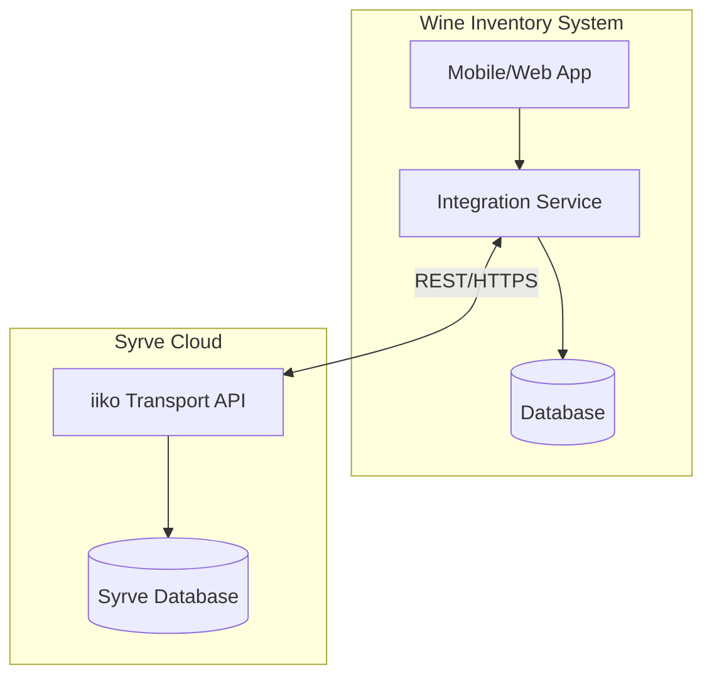
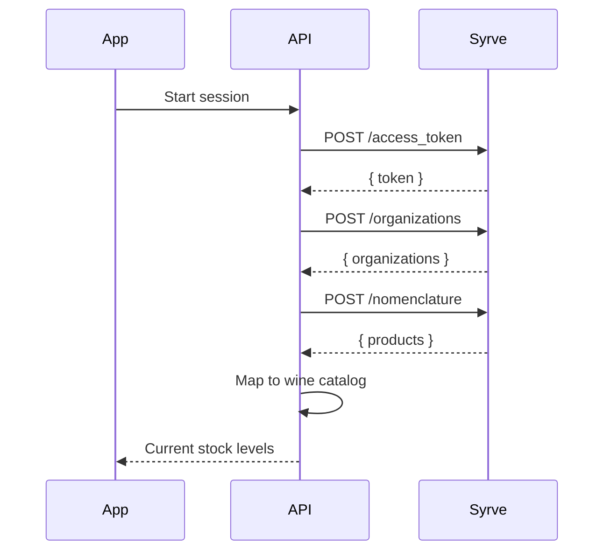
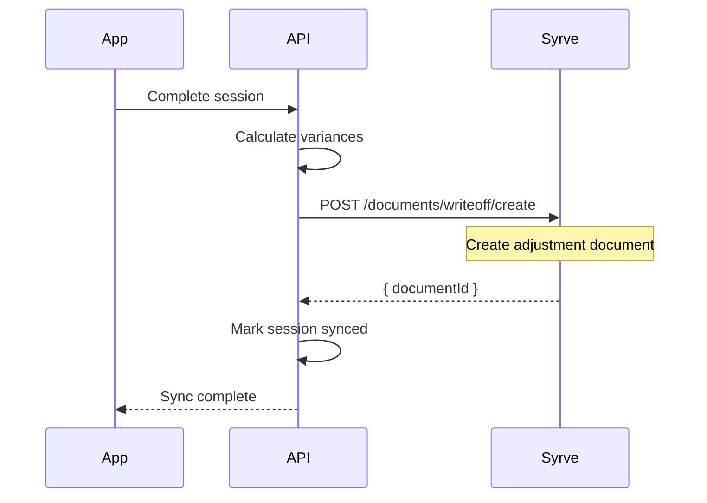

# Syrve (iiko) Integration

## Overview

The Wine Inventory Management System integrates with Syrve (formerly iiko) restaurant management platform for bi-directional stock synchronization.

---

## Integration Architecture



---

## API Configuration

### Base URLs

| Region | URL |
|--------|-----|
| Europe | `https://api-eu.iiko.services` |
| Russia | `https://api-ru.iiko.services` |

### Environment Variables

```env
VITE_SYRVE_API_LOGIN=your_api_login
VITE_SYRVE_API_REGION=eu
```

---

## Authentication

Syrve uses Bearer Token authentication with time-limited tokens.

### Obtain Token

```typescript
const response = await fetch('https://api-eu.iiko.services/api/1/access_token', {
  method: 'POST',
  headers: { 'Content-Type': 'application/json' },
  body: JSON.stringify({ apiLogin: process.env.SYRVE_API_LOGIN })
});

const { token, tokenLifeTime } = await response.json();
// tokenLifeTime = 3600 seconds (1 hour)
```

### Token Management

```typescript
class SyrveAuthService {
  private token: string | null = null;
  private tokenExpiry: Date | null = null;

  async getValidToken(): Promise<string> {
    // Refresh 5 minutes before expiry
    const buffer = 5 * 60 * 1000;
    if (this.token && this.tokenExpiry && 
        this.tokenExpiry.getTime() > Date.now() + buffer) {
      return this.token;
    }
    return this.refreshToken();
  }
}
```

---

## Data Flows

### 1. Get Stock from Syrve

**When:** Start of inventory session  
**Purpose:** Display current stock levels from POS



### 2. Push Updates to Syrve

**When:** After inventory session completion  
**Purpose:** Update Syrve with counted quantities



---

## API Endpoints

### Get Organizations

```typescript
const response = await syrve.post('/api/1/organizations', {
  returnAdditionalInfo: true,
  includeDisabled: false
});

// Response
{
  organizations: [{
    id: "uuid",
    name: "Restaurant Name",
    country: "PT",
    currencyIsoName: "EUR"
  }]
}
```

### Get Product Catalog

```typescript
const response = await syrve.post('/api/1/nomenclature', {
  organizationId: orgId,
  startRevision: 0  // 0 for full sync
});

// Response
{
  revision: 12345,
  groups: [...],
  products: [{
    id: "product-uuid",
    name: "Wine Name",
    code: "SKU-001",
    measureUnit: "bottle",
    prices: [{ price: 25.00 }]
  }]
}
```

### Create Write-off Document

```typescript
const response = await syrve.post('/api/1/documents/writeoff/create', {
  organizationId: orgId,
  documentId: generateUUID(),
  dateIncoming: new Date().toISOString(),
  comment: `Inventory variance - Session ${sessionId}`,
  items: [{
    productId: "product-uuid",
    amount: 2.0,
    sum: 50.00,
    comment: "Shortage: Expected 10, Counted 8"
  }]
});
```

---

## Product Mapping

### Linking Wine to Syrve Product

```sql
-- wine_variants table stores Syrve product IDs
ALTER TABLE wine_variants 
ADD COLUMN syrve_product_id TEXT;
```

### Mapping Logic

```typescript
async function mapSyrveToWines(syrveProducts: SyrveProduct[]) {
  for (const product of syrveProducts) {
    // Try to match by barcode
    let wine = await findWineByBarcode(product.code);
    
    // Fallback to name matching
    if (!wine) {
      wine = await findWineByName(product.name);
    }
    
    if (wine) {
      await supabase
        .from('wine_variants')
        .update({ syrve_product_id: product.id })
        .eq('base_wine_id', wine.id);
    }
  }
}
```

---

## Sync Operations

### Stock Retrieval

1. Get all products from Syrve `/nomenclature`
2. Match products to wine catalog
3. Retrieve stop list (out-of-stock items)
4. Update local stock cache
5. Display in inventory session

### Stock Update (After Count)

1. Complete inventory session
2. Calculate variances per wine
3. Map wines to Syrve product IDs
4. Create write-off documents for shortages
5. Mark session as synced
6. Log sync status for audit

---

## Error Handling

| Error | Code | Action |
|-------|------|--------|
| Invalid API login | 401 | Check credentials |
| Token expired | 401 | Refresh token, retry |
| License inactive | 403 | Contact Syrve support |
| Rate limit | 429 | Exponential backoff |
| Product not found | 404 | Queue for manual mapping |

### Retry Logic

```typescript
async function retryWithBackoff<T>(
  fn: () => Promise<T>,
  maxRetries = 3
): Promise<T> {
  let lastError: Error;
  
  for (let i = 0; i < maxRetries; i++) {
    try {
      return await fn();
    } catch (error) {
      lastError = error;
      if (error.status === 429 || error.status >= 500) {
        await sleep(Math.pow(2, i) * 1000);
        continue;
      }
      throw error;
    }
  }
  
  throw lastError;
}
```

---

## Webhooks (Future)

Syrve can send real-time updates via webhooks:

```typescript
// Webhook handler
app.post('/api/webhooks/syrve', async (req, res) => {
  const { eventType, organizationId, productId, newBalance } = req.body;
  
  if (eventType === 'StockUpdate') {
    // Update local stock cache
    await updateStockFromSyrve(productId, newBalance);
    
    // Notify active sessions via WebSocket
    io.to(`org:${organizationId}`).emit('stockUpdate', {
      productId,
      newBalance
    });
  }
  
  res.sendStatus(200);
});
```

---

## Security

- API credentials stored in environment variables
- Tokens never exposed to frontend
- All API calls through backend proxy
- Webhook signatures validated
- Rate limiting on sync endpoints

---

## Monitoring

Track integration health:
- Token refresh success rate
- API response times
- Sync success/failure counts
- Mapping coverage percentage
- Last successful sync timestamp

```sql
-- Sync status tracking
CREATE TABLE syrve_sync_log (
  id UUID PRIMARY KEY DEFAULT gen_random_uuid(),
  sync_type TEXT NOT NULL,
  session_id UUID REFERENCES inventory_sessions(id),
  status TEXT NOT NULL,
  products_synced INTEGER,
  errors JSONB,
  started_at TIMESTAMPTZ NOT NULL,
  completed_at TIMESTAMPTZ
);
```
