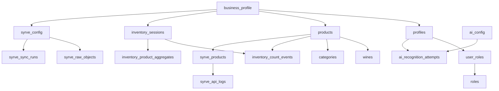

# Canonical Database Schema

Complete multi-tenant database schema for the Wine Inventory Management System. This schema implements the Syrve-first, event-sourced architecture while maintaining compatibility with existing code through views.

## 🏗️ Schema Architecture



## 📋 Table Reference

### **Core Business & Auth Tables**

#### `business_profile`
Root tenant table for multi-tenancy isolation.

```sql
CREATE TABLE business_profile (
    id UUID PRIMARY KEY DEFAULT gen_random_uuid(),
    name TEXT NOT NULL,
    slug TEXT UNIQUE NOT NULL,
    description TEXT,
    metadata JSONB DEFAULT '{}',
    is_active BOOLEAN DEFAULT true,
    created_at TIMESTAMPTZ DEFAULT now(),
    updated_at TIMESTAMPTZ DEFAULT now()
);

-- Indexes
CREATE INDEX idx_business_profile_slug ON business_profile(slug);
CREATE INDEX idx_business_profile_active ON business_profile(is_active);
```

#### `profiles`
User profiles linked to Supabase auth.users.

```sql
CREATE TABLE profiles (
    id UUID PRIMARY KEY REFERENCES auth.users(id) ON DELETE CASCADE,
    business_id UUID NOT NULL REFERENCES business_profile(id) ON DELETE CASCADE,
    full_name TEXT,
    email TEXT, -- Optional mirror of auth.users.email
    login_name TEXT NOT NULL,
    avatar_url TEXT,
    is_active BOOLEAN DEFAULT true,
    metadata JSONB DEFAULT '{}',
    created_at TIMESTAMPTZ DEFAULT now(),
    updated_at TIMESTAMPTZ DEFAULT now(),
    
    UNIQUE(business_id, login_name)
);

-- Indexes
CREATE INDEX idx_profiles_business ON profiles(business_id);
CREATE INDEX idx_profiles_login_name ON profiles(business_id, login_name);
CREATE INDEX idx_profiles_active ON profiles(is_active);
```

#### `roles`
System roles with JSONB permissions.

```sql
CREATE TYPE permission_level AS ENUM ('none', 'view', 'edit', 'full');

CREATE TABLE roles (
    id UUID PRIMARY KEY DEFAULT gen_random_uuid(),
    business_id UUID NOT NULL REFERENCES business_profile(id) ON DELETE CASCADE,
    name TEXT NOT NULL,
    description TEXT,
    color TEXT,
    permissions JSONB NOT NULL DEFAULT '{}', -- {"module.subaction": "level"}
    is_system_role BOOLEAN DEFAULT false,
    is_super_admin BOOLEAN DEFAULT false,
    created_at TIMESTAMPTZ DEFAULT now(),
    updated_at TIMESTAMPTZ DEFAULT now(),
    
    UNIQUE(business_id, name)
);

-- Indexes
CREATE INDEX idx_roles_business ON roles(business_id);
CREATE INDEX idx_roles_system ON roles(is_system_role);
CREATE INDEX idx_roles_super_admin ON roles(is_super_admin);
```

#### `user_roles`
Many-to-many relationship between users and roles.

```sql
CREATE TABLE user_roles (
    id UUID PRIMARY KEY DEFAULT gen_random_uuid(),
    business_id UUID NOT NULL REFERENCES business_profile(id) ON DELETE CASCADE,
    user_id UUID NOT NULL REFERENCES profiles(id) ON DELETE CASCADE,
    role_id UUID NOT NULL REFERENCES roles(id) ON DELETE CASCADE,
    is_primary BOOLEAN DEFAULT false,
    created_at TIMESTAMPTZ DEFAULT now(),
    
    UNIQUE(business_id, user_id, role_id)
);

-- Indexes
CREATE INDEX idx_user_roles_business ON user_roles(business_id);
CREATE INDEX idx_user_roles_user ON user_roles(user_id);
CREATE INDEX idx_user_roles_role ON user_roles(role_id);
CREATE INDEX idx_user_roles_primary ON user_roles(user_id, is_primary) WHERE is_primary = true;
```

### **Product Catalog Tables**

#### `categories`
Product categories with Syrve integration.

```sql
CREATE TABLE categories (
    id UUID PRIMARY KEY DEFAULT gen_random_uuid(),
    business_id UUID NOT NULL REFERENCES business_profile(id) ON DELETE CASCADE,
    name TEXT NOT NULL,
    description TEXT,
    parent_id UUID REFERENCES categories(id),
    syrve_group_id TEXT,
    metadata JSONB DEFAULT '{}',
    is_active BOOLEAN DEFAULT true,
    sort_order INTEGER DEFAULT 0,
    created_at TIMESTAMPTZ DEFAULT now(),
    updated_at TIMESTAMPTZ DEFAULT now(),
    
    UNIQUE(business_id, name)
);

-- Indexes
CREATE INDEX idx_categories_business ON categories(business_id);
CREATE INDEX idx_categories_parent ON categories(parent_id);
CREATE INDEX idx_categories_syrve ON categories(business_id, syrve_group_id);
CREATE INDEX idx_categories_active ON categories(is_active);
```

#### `products`
Generic products with optional wine enrichment.

```sql
CREATE TABLE products (
    id UUID PRIMARY KEY DEFAULT gen_random_uuid(),
    business_id UUID NOT NULL REFERENCES business_profile(id) ON DELETE CASCADE,
    category_id UUID REFERENCES categories(id),
    name TEXT NOT NULL,
    sku TEXT,
    barcode TEXT,
    description TEXT,
    unit_type TEXT DEFAULT 'bottle',
    cost_price DECIMAL(10,2),
    selling_price DECIMAL(10,2),
    stock_on_hand INTEGER DEFAULT 0,
    stock_reserved INTEGER DEFAULT 0,
    stock_available INTEGER GENERATED ALWAYS AS (stock_on_hand - stock_reserved) STORED,
    reorder_level INTEGER DEFAULT 0,
    reorder_quantity INTEGER DEFAULT 0,
    syrve_product_id TEXT,
    image_url TEXT,
    metadata JSONB DEFAULT '{}',
    is_active BOOLEAN DEFAULT true,
    created_at TIMESTAMPTZ DEFAULT now(),
    updated_at TIMESTAMPTZ DEFAULT now(),
    
    UNIQUE(business_id, sku),
    UNIQUE(business_id, barcode),
    UNIQUE(business_id, syrve_product_id)
);

-- Indexes
CREATE INDEX idx_products_business ON products(business_id);
CREATE INDEX idx_products_category ON products(category_id);
CREATE INDEX idx_products_syrve ON products(business_id, syrve_product_id);
CREATE INDEX idx_products_sku ON products(business_id, sku);
CREATE INDEX idx_products_active ON products(is_active);
```

#### `wines`
Wine-specific enrichment for products.

```sql
CREATE TABLE wines (
    id UUID PRIMARY KEY DEFAULT gen_random_uuid(),
    business_id UUID NOT NULL REFERENCES business_profile(id) ON DELETE CASCADE,
    product_id UUID NOT NULL UNIQUE REFERENCES products(id) ON DELETE CASCADE,
    vintage INTEGER,
    producer TEXT,
    region TEXT,
    country TEXT,
    wine_type TEXT, -- red, white, sparkling, etc.
    grape_varieties TEXT[],
    alcohol_percentage DECIMAL(4,2),
    bottle_size_ml INTEGER DEFAULT 750,
    closure_type TEXT,
    organic BOOLEAN DEFAULT false,
    biodynamic BOOLEAN DEFAULT false,
    tasting_notes TEXT,
    food_pairing TEXT[],
    serving_temperature TEXT,
    drinking_window_start INTEGER,
    drinking_window_end INTEGER,
    critic_scores JSONB DEFAULT '{}', -- {"source": score}
    awards JSONB DEFAULT '{}',
    metadata JSONB DEFAULT '{}',
    created_at TIMESTAMPTZ DEFAULT now(),
    updated_at TIMESTAMPTZ DEFAULT now()
);

-- Indexes
CREATE INDEX idx_wines_business ON wines(business_id);
CREATE INDEX idx_wines_product ON wines(product_id);
CREATE INDEX idx_wines_vintage ON wines(vintage);
CREATE INDEX idx_wines_type ON wines(wine_type);
CREATE INDEX idx_wines_producer ON wines(producer);
```

### **Inventory Management Tables**

#### `inventory_sessions`
Inventory counting sessions.

```sql
CREATE TYPE inventory_session_status AS ENUM ('draft', 'in_progress', 'paused', 'completed', 'approved', 'flagged');
CREATE TYPE inventory_session_type AS ENUM ('full', 'partial', 'cycle', 'receiving');

CREATE TABLE inventory_sessions (
    id UUID PRIMARY KEY DEFAULT gen_random_uuid(),
    business_id UUID NOT NULL REFERENCES business_profile(id) ON DELETE CASCADE,
    session_name TEXT NOT NULL,
    session_type inventory_session_type DEFAULT 'full',
    status inventory_session_status DEFAULT 'draft',
    location_filter TEXT,
    started_by UUID REFERENCES profiles(id),
    approved_by UUID REFERENCES profiles(id),
    started_at TIMESTAMPTZ,
    completed_at TIMESTAMPTZ,
    approved_at TIMESTAMPTZ,
    total_products_expected INTEGER DEFAULT 0,
    total_products_counted INTEGER DEFAULT 0,
    variance_total DECIMAL(10,2) DEFAULT 0,
    notes TEXT,
    metadata JSONB DEFAULT '{}',
    created_at TIMESTAMPTZ DEFAULT now(),
    updated_at TIMESTAMPTZ DEFAULT now()
);

-- Indexes
CREATE INDEX idx_inventory_sessions_business ON inventory_sessions(business_id);
CREATE INDEX idx_inventory_sessions_status ON inventory_sessions(status);
CREATE INDEX idx_inventory_sessions_started_by ON inventory_sessions(started_by);
```

#### `inventory_count_events`
Event-sourced inventory counting (append-only).

```sql
CREATE TYPE counting_method AS ENUM ('manual', 'barcode', 'image_ai', 'voice');

CREATE TABLE inventory_count_events (
    id UUID PRIMARY KEY DEFAULT gen_random_uuid(),
    business_id UUID NOT NULL REFERENCES business_profile(id) ON DELETE CASCADE,
    session_id UUID NOT NULL REFERENCES inventory_sessions(id) ON DELETE CASCADE,
    product_id UUID NOT NULL REFERENCES products(id) ON DELETE CASCADE,
    counted_by UUID NOT NULL REFERENCES profiles(id),
    location TEXT,
    counted_at TIMESTAMPTZ DEFAULT now(),
    quantity_unopened INTEGER DEFAULT 0,
    quantity_opened INTEGER DEFAULT 0,
    quantity_total INTEGER GENERATED ALWAYS AS (quantity_unopened + quantity_opened) STORED,
    counting_method counting_method DEFAULT 'manual',
    confidence_score DECIMAL(3,2), -- for AI counting
    image_url TEXT, -- for AI counting evidence
    notes TEXT,
    metadata JSONB DEFAULT '{}',
    created_at TIMESTAMPTZ DEFAULT now()
);

-- Indexes
CREATE INDEX idx_inventory_count_events_business ON inventory_count_events(business_id);
CREATE INDEX idx_inventory_count_events_session ON inventory_count_events(session_id);
CREATE INDEX idx_inventory_count_events_product ON inventory_count_events(product_id);
CREATE INDEX idx_inventory_count_events_counted_by ON inventory_count_events(counted_by);
CREATE INDEX idx_inventory_count_events_counted_at ON inventory_count_events(counted_at);
```

#### `inventory_product_aggregates`
Materialized aggregates for fast reads.

```sql
CREATE TABLE inventory_product_aggregates (
    id UUID PRIMARY KEY DEFAULT gen_random_uuid(),
    business_id UUID NOT NULL REFERENCES business_profile(id) ON DELETE CASCADE,
    session_id UUID NOT NULL REFERENCES inventory_sessions(id) ON DELETE CASCADE,
    product_id UUID NOT NULL REFERENCES products(id) ON DELETE CASCADE,
    total_counted_unopened INTEGER DEFAULT 0,
    total_counted_opened INTEGER DEFAULT 0,
    total_counted_total INTEGER DEFAULT 0,
    first_counted_at TIMESTAMPTZ,
    last_counted_at TIMESTAMPTZ,
    count_events INTEGER DEFAULT 0,
    variance_unopened INTEGER DEFAULT 0,
    variance_opened INTEGER DEFAULT 0,
    variance_total INTEGER DEFAULT 0,
    created_at TIMESTAMPTZ DEFAULT now(),
    updated_at TIMESTAMPTZ DEFAULT now(),
    
    UNIQUE(business_id, session_id, product_id)
);

-- Indexes
CREATE INDEX idx_inventory_aggregates_business ON inventory_product_aggregates(business_id);
CREATE INDEX idx_inventory_aggregates_session ON inventory_product_aggregates(session_id);
CREATE INDEX idx_inventory_aggregates_product ON inventory_product_aggregates(product_id);
```

### **Syrve Integration Tables**

#### `syrve_config`
Syrve POS integration configuration (singleton per business).

```sql
CREATE TABLE syrve_config (
    id UUID PRIMARY KEY DEFAULT gen_random_uuid(),
    business_id UUID NOT NULL UNIQUE REFERENCES business_profile(id) ON DELETE CASCADE,
    api_base_url TEXT NOT NULL DEFAULT 'https://api.syrve.com',
    client_id TEXT NOT NULL,
    api_login TEXT NOT NULL,
    api_password_hash TEXT NOT NULL, -- encrypted
    unit_id TEXT,
    organization_id TEXT,
    sync_enabled BOOLEAN DEFAULT false,
    sync_frequency TEXT DEFAULT 'hourly', -- hourly, daily, weekly
    last_sync_at TIMESTAMPTZ,
    sync_error_count INTEGER DEFAULT 0,
    metadata JSONB DEFAULT '{}',
    created_at TIMESTAMPTZ DEFAULT now(),
    updated_at TIMESTAMPTZ DEFAULT now()
);

-- Indexes
CREATE INDEX idx_syrve_config_business ON syrve_config(business_id);
CREATE INDEX idx_syrve_config_sync_enabled ON syrve_config(sync_enabled);
```

#### `syrve_products`
Syrve product mapping and metadata.

```sql
CREATE TABLE syrve_products (
    id UUID PRIMARY KEY DEFAULT gen_random_uuid(),
    business_id UUID NOT NULL REFERENCES business_profile(id) ON DELETE CASCADE,
    syrve_product_id TEXT NOT NULL,
    name TEXT NOT NULL,
    sku TEXT,
    barcode TEXT,
    group_id TEXT,
    group_name TEXT,
    unit TEXT,
    price DECIMAL(10,2),
    cost DECIMAL(10,2),
    stock_on_hand INTEGER DEFAULT 0,
    is_active BOOLEAN DEFAULT true,
    raw_data JSONB NOT NULL,
    mapped_product_id UUID REFERENCES products(id),
    mapping_confidence DECIMAL(3,2),
    mapping_notes TEXT,
    last_sync_at TIMESTAMPTZ,
    created_at TIMESTAMPTZ DEFAULT now(),
    updated_at TIMESTAMPTZ DEFAULT now(),
    
    UNIQUE(business_id, syrve_product_id)
);

-- Indexes
CREATE INDEX idx_syrve_products_business ON syrve_products(business_id);
CREATE INDEX idx_syrve_products_syrve_id ON syrve_products(business_id, syrve_product_id);
CREATE INDEX idx_syrve_products_mapped ON syrve_products(mapped_product_id);
CREATE INDEX idx_syrve_products_group ON syrve_products(group_id);
```

#### `syrve_sync_runs`
Syrve synchronization job tracking.

```sql
CREATE TYPE sync_status AS ENUM ('pending', 'running', 'completed', 'failed', 'cancelled');
CREATE TYPE sync_type AS ENUM ('products', 'stock', 'orders', 'full');

CREATE TABLE syrve_sync_runs (
    id UUID PRIMARY KEY DEFAULT gen_random_uuid(),
    business_id UUID NOT NULL REFERENCES business_profile(id) ON DELETE CASCADE,
    sync_type sync_type NOT NULL,
    status sync_status DEFAULT 'pending',
    started_at TIMESTAMPTZ DEFAULT now(),
    completed_at TIMESTAMPTZ,
    duration_ms INTEGER,
    items_processed INTEGER DEFAULT 0,
    items_created INTEGER DEFAULT 0,
    items_updated INTEGER DEFAULT 0,
    items_skipped INTEGER DEFAULT 0,
    errors_count INTEGER DEFAULT 0,
    error_details JSONB DEFAULT '[]',
    sync_config JSONB DEFAULT '{}',
    created_by UUID REFERENCES profiles(id),
    created_at TIMESTAMPTZ DEFAULT now()
);

-- Indexes
CREATE INDEX idx_syrve_sync_runs_business ON syrve_sync_runs(business_id);
CREATE INDEX idx_syrve_sync_runs_type ON syrve_sync_runs(sync_type);
CREATE INDEX idx_syrve_sync_runs_status ON syrve_sync_runs(status);
CREATE INDEX idx_syrve_sync_runs_created_at ON syrve_sync_runs(created_at DESC);
```

#### `syrve_raw_objects`
Lossless raw data storage from Syrve API.

```sql
CREATE TABLE syrve_raw_objects (
    id UUID PRIMARY KEY DEFAULT gen_random_uuid(),
    business_id UUID NOT NULL REFERENCES business_profile(id) ON DELETE CASCADE,
    object_type TEXT NOT NULL, -- products, groups, departments, etc.
    object_id TEXT NOT NULL,
    sync_run_id UUID REFERENCES syrve_sync_runs(id) ON DELETE SET NULL,
    raw_data JSONB NOT NULL,
    hash TEXT NOT NULL, -- SHA256 of raw_data for change detection
    created_at TIMESTAMPTZ DEFAULT now(),
    
    UNIQUE(business_id, object_type, object_id, hash)
);

-- Indexes
CREATE INDEX idx_syrve_raw_objects_business ON syrve_raw_objects(business_id);
CREATE INDEX idx_syrve_raw_objects_type ON syrve_raw_objects(object_type);
CREATE INDEX idx_syrve_raw_objects_sync ON syrve_raw_objects(sync_run_id);
```

#### `syrve_api_logs`
Syrve API request/response logging.

```sql
CREATE TYPE api_request_type AS ENUM ('GET', 'POST', 'PUT', 'DELETE');

CREATE TABLE syrve_api_logs (
    id UUID PRIMARY KEY DEFAULT gen_random_uuid(),
    business_id UUID NOT NULL REFERENCES business_profile(id) ON DELETE CASCADE,
    sync_run_id UUID REFERENCES syrve_sync_runs(id) ON DELETE SET NULL,
    request_type api_request_type NOT NULL,
    endpoint TEXT NOT NULL,
    request_body JSONB,
    response_status INTEGER,
    response_body JSONB,
    error_message TEXT,
    duration_ms INTEGER,
    retry_count INTEGER DEFAULT 0,
    created_at TIMESTAMPTZ DEFAULT now()
);

-- Indexes
CREATE INDEX idx_syrve_api_logs_business ON syrve_api_logs(business_id);
CREATE INDEX idx_syrve_api_logs_sync ON syrve_api_logs(sync_run_id);
CREATE INDEX idx_syrve_api_logs_created ON syrve_api_logs(created_at DESC);
```

### **AI Recognition Tables**

#### `ai_config`
AI recognition service configuration.

```sql
CREATE TABLE ai_config (
    id UUID PRIMARY KEY DEFAULT gen_random_uuid(),
    business_id UUID NOT NULL UNIQUE REFERENCES business_profile(id) ON DELETE CASCADE,
    provider TEXT NOT NULL DEFAULT 'gemini',
    model TEXT NOT NULL DEFAULT 'gemini-1.5-flash',
    api_key_hash TEXT NOT NULL, -- encrypted
    is_active BOOLEAN DEFAULT false,
    confidence_threshold DECIMAL(3,2) DEFAULT 0.8,
    max_attempts_per_image INTEGER DEFAULT 3,
    rate_limit_per_minute INTEGER DEFAULT 60,
    custom_prompts JSONB DEFAULT '{}',
    metadata JSONB DEFAULT '{}',
    created_at TIMESTAMPTZ DEFAULT now(),
    updated_at TIMESTAMPTZ DEFAULT now()
);

-- Indexes
CREATE INDEX idx_ai_config_business ON ai_config(business_id);
CREATE INDEX idx_ai_config_active ON ai_config(is_active);
```

#### `ai_recognition_attempts`
AI recognition attempt tracking.

```sql
CREATE TYPE recognition_status AS ENUM ('pending', 'processing', 'success', 'failed', 'timeout');

CREATE TABLE ai_recognition_attempts (
    id UUID PRIMARY KEY DEFAULT gen_random_uuid(),
    business_id UUID NOT NULL REFERENCES business_profile(id) ON DELETE CASCADE,
    user_id UUID REFERENCES profiles(id),
    session_id UUID REFERENCES inventory_sessions(id),
    image_url TEXT NOT NULL,
    image_hash TEXT NOT NULL,
    provider TEXT NOT NULL,
    model TEXT NOT NULL,
    status recognition_status DEFAULT 'pending',
    recognized_product_id UUID REFERENCES products(id),
    recognized_product_name TEXT,
    confidence_score DECIMAL(3,2),
    raw_response JSONB,
    error_message TEXT,
    processing_duration_ms INTEGER,
    retry_count INTEGER DEFAULT 0,
    created_at TIMESTAMPTZ DEFAULT now(),
    updated_at TIMESTAMPTZ DEFAULT now()
);

-- Indexes
CREATE INDEX idx_ai_recognition_business ON ai_recognition_attempts(business_id);
CREATE INDEX idx_ai_recognition_user ON ai_recognition_attempts(user_id);
CREATE INDEX idx_ai_recognition_session ON ai_recognition_attempts(session_id);
CREATE INDEX idx_ai_recognition_status ON ai_recognition_attempts(status);
CREATE INDEX idx_ai_recognition_image ON ai_recognition_attempts(image_hash);
```

## 🔑 Primary Keys & Relationships

### **Core Relationships**
- `profiles.id` → `auth.users.id` (1:1)
- `profiles.business_id` → `business_profile.id` (N:1)
- `products.business_id` → `business_profile.id` (N:1)
- `wines.product_id` → `products.id` (1:1)
- `inventory_count_events.session_id` → `inventory_sessions.id` (N:1)
- `inventory_count_events.product_id` → `products.id` (N:1)

### **Syrve Integration**
- `syrve_config.business_id` → `business_profile.id` (1:1)
- `syrve_products.business_id` → `business_profile.id` (N:1)
- `syrve_products.mapped_product_id` → `products.id` (N:1)

## 📊 Next Steps

1. Review [compatibility layer](02-compatibility-layer.md) for legacy code support
2. Implement [RLS policies](03-auth-rls-policies.md) for security
3. Deploy [migration pack](05-migration-pack.sql) to new Supabase project
4. Configure [Edge Functions](04-edge-functions-spec.md) for business logic